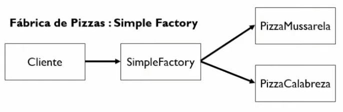
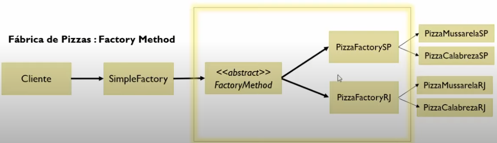
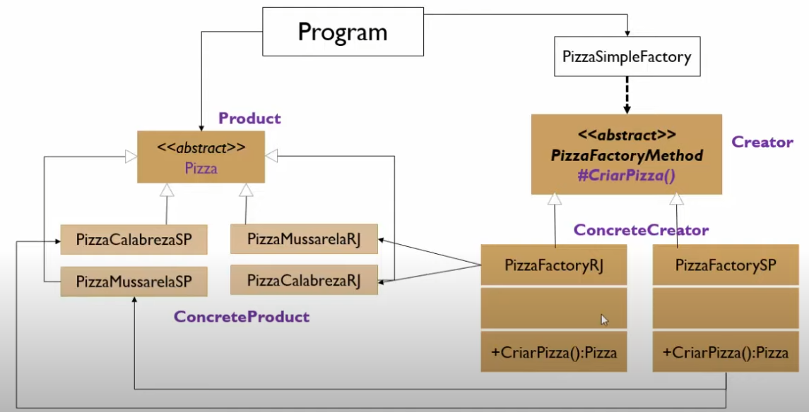
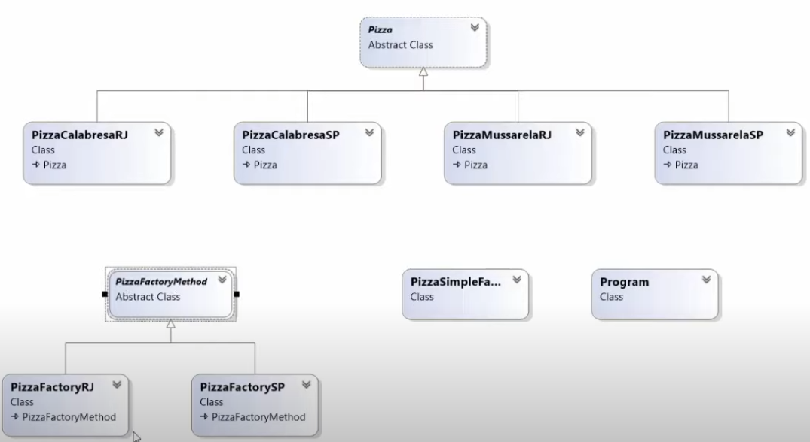

***Guideline***

- [***Factory Method***](#---factory-method---)
  * [***Intenção e Objetivo***](#---inten--o-e-objetivo---)
  * [***Diagrama UML***](#---diagrama-uml---)
  * [***Benefícios***](#---benef-cios---)
  * [***Exemplo***](#---exemplo---)

# ***Factory Method***

## ***Intenção e Objetivo***.     
  
* Definir uma interface para criar objetos mas permitir que as subclasses decidam qual classe instanciar.
  
* Permitir que cliente não precise saber quais tipos de objetos serão criados.
* Usa a herança e depende de uma subclasse para tratar com a instanciação do objeto desejado.
* Cria uma instância de várias classes derivadas.

***Obs.: USADO PARA CRIAR OBJETOS SEM EXPOR A LÓGICA DE CRIAÇÃO DO OBJETO AO CLIENTE.***  
___

## ***Diagrama UML***  
___

* ***Product*** - Define a interface de objetos que o Factory Method cria.  

* ***ConcreteProduct*** - É a classe que implementa a interface ***Product***.  

* ***Creator*** - É a classe abstrata/interface que declara o Factory Method, o qual retorna um objeto do tipo ***Product***.

* ***ConcreteCreator*** - É a classe que implementa a classe ***Creator*** e sobrescreve Factory Method para retornar a instância de ***ConcreteProduct*** (Decide qual classe instanciar).

___
## ***Benefícios***
___

* A subclasses Factory possuem controle total sobre o processo de criação dos objetos podendo retornar o tipo desejado ou uma subclasse.  

* Remoção do forte acoplamento entre classes.  

* Encapsulamento do código que varia (instanciação da classe) em um único local.

* Facilita a manutenção do código.

___
## ***Exemplo***
___

***Fábrica de Pizzas***

